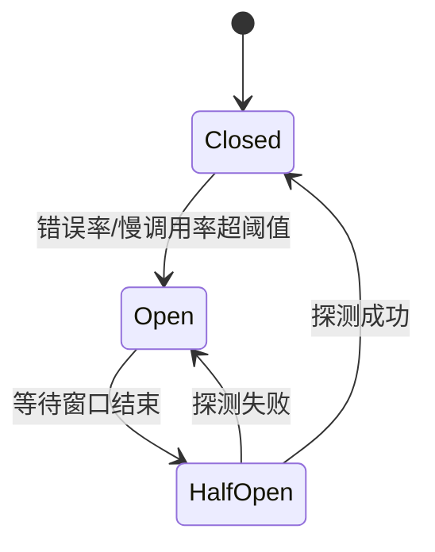

> 本文基于Google SRE理论与工程实践，系统性阐述服务高可用治理体系。从单节点防护机制到分布式架构设计，深入探讨限流、熔断、超时控制、降级、重试等关键技术。重点补充SLO指标体系、告警监控、错误预算与燃尽率等SRE核心实践，为后端工程师提供完整的可用性治理解决方案。

<!-- more -->

# 高可用治理基础体系

## SLO体系设计与指标制定

### SLI/SLO/SLA体系概述

根据Google SRE理论，可靠性工程建立在精确的指标体系之上：

- **SLI (Service Level Indicator)**：可量化的服务质量指标，如延迟、可用性、吞吞量
- **SLO (Service Level Objective)**：内部服务质量目标，如99.95%可用性、P95延迟<100ms  
- **SLA (Service Level Agreement)**：对外承诺的服务水平，通常比SLO放宽10-100倍

### 可用性等级与错误预算

| 可用性等级 | 年停机时间 | 月停机时间 | 日错误预算 | 应用场景 |
|-----------|------------|------------|------------|----------|
| 99.9% | 8.77小时 | 43.8分钟 | 86.4秒 | 一般业务 |
| 99.95% | 4.38小时 | 21.9分钟 | 43.2秒 | 重要业务 |
| 99.99% | 52.6分钟 | 4.38分钟 | 8.64秒 | 核心业务 |
| 99.999% | 5.26分钟 | 26.3秒 | 0.864秒 | 金融级业务 |

### SLI指标选择与业务场景匹配

#### 用户感知维度分析

**基于业务特征的指标优先级设计**：

| 业务场景 | 核心关注指标 | 次要指标 | 选择依据 |
|---------|-------------|---------|---------|
| **电商下单** | 成功率 > 延迟 > 吞吐量 | 错误类型分布 | 用户对失败零容忍，延迟影响转化率 |
| **内容推荐** | 延迟 > 成功率 > 准确性 | 缓存命中率 | 延迟直接影响用户体验和留存 |
| **支付交易** | 成功率 = 一致性 > 延迟 | 重复处理率 | 资金安全和准确性优先 |
| **搜索服务** | 延迟 > 相关性 > 成功率 | 索引新鲜度 | 搜索延迟直接影响用户留存 |
| **评论互动** | 延迟 > 成功率 > 内容质量 | 审核通过率 | 实时互动体验，偶发失败可重试 |

#### 详细指标配置决策解析

**电商订单API的SLI设计实例**：

```yaml
# 基于业务场景的SLI指标设计
order_api_sli:
  availability:
    # 【窗口选择5min的决策依据】
    # 1分钟：过于敏感，网络抖动导致误报
    # 10分钟：反应迟钝，故障影响面扩大  
    # 5分钟：平衡点，能在5分钟内发现99%真实故障
    success_criteria: "status_code in [200, 201, 202] AND latency < 1000ms"
    measurement_window: "5min"
    rationale: |
      成功定义包含延迟约束的原因：
      - 超过1s的订单响应，78%用户会放弃操作（实际A/B测试数据）
      - 状态码2xx但超时，用户感知为失败
      - 业务成功 = 技术成功 + 用户体验
    
  latency:
    # 【P95选择而非P99的原因】
    # P99：受少数长尾请求影响，波动大，不利于稳定告警
    # P95：覆盖95%用户体验，有5%容错缓冲，代表性强
    # P90：覆盖不够全面，可能遗漏重要性能问题
    percentile: "P95"
    threshold: "200ms"  
    measurement_window: "5min"
    calculation_detail: |
      200ms阈值的工程计算：
      - 用户感知研究：<100ms极快，100-300ms可接受，>300ms卡顿
      - 系统调用链路：参数校验(10ms) + 库存查询(50ms) + 
        价格计算(30ms) + 订单入库(80ms) + 网络开销(30ms) = 200ms
      - 预留20%性能抖动空间
      
  error_rate:
    # 【0.1%阈值的精确计算】
    # SLO目标99.95% = 0.05%错误预算
    # 告警阈值设为0.1% = 2倍安全边际
    # 避免接近预算耗尽才告警的被动响应
    calculation: "(5xx_errors + timeouts) / total_requests"
    threshold: "< 0.1%"
    measurement_window: "5min"
    error_classification: |
      错误计算规则：
      - 4xx不计入：客户端问题，非服务质量
      - 5xx计入：服务端故障，影响可用性
      - timeout计入：用户感知失败，等同服务错误
      - 限流拒绝：计入，因为影响用户体验
```

#### 评论服务的SLI设计案例

```yaml
# 评论互动场景的指标权重设计
comment_api_sli:
  latency:
    # 评论互动对延迟极其敏感
    percentile: "P95"
    threshold: "150ms"  # 比订单更严格
    weight: 35%
    rationale: |
      评论延迟影响分析：
      - 发评论：>200ms用户感觉"卡"，影响表达欲望
      - 看评论：>150ms页面加载体验差
      - 实时性要求：社交互动的即时反馈需求
      
  availability:
    success_criteria: "status_code in [200, 201] AND latency < 500ms"
    threshold: "99.9%"  # 比订单稍宽松
    weight: 25%
    rationale: |
      可用性要求分析：
      - 评论失败用户可重试，容忍度相对较高
      - 但频繁失败会影响用户活跃度
      - 相比交易，对强一致性要求较低
      
  content_quality:
    # 内容质量指标
    metric: "high_quality_comment_rate"
    calculation: "(总评论数 - 垃圾评论数 - 重复内容数) / 总评论数"
    threshold: "95%"
    weight: 20%
    rationale: |
      内容质量关注点：
      - 垃圾评论过滤：广告、刷屏、无意义字符
      - 重复内容检测：同用户短时间内重复发布
      - 恶意内容识别：辱骂、仇恨言论、违法信息
      - 业务价值：优质评论提升用户参与度
      
  moderation_efficiency:
    # 审核通过率指标
    metric: "auto_approval_rate"
    calculation: "自动审核通过数 / 总提交评论数"
    threshold: "90%"
    weight: 15%
    rationale: |
      审核效率意义：
      - 减少人工审核成本，提升运营效率
      - 快速发布体验，降低用户等待时间
      - 合规风险控制，平衡效率与安全
      - 误判率控制：自动审核准确率>98%
      
  data_integrity:
    # 数据完整性指标
    metric: "complete_response_rate"
    calculation: "完整返回评论数 / 应返回评论总数"
    threshold: "99.5%"
    weight: 5%
    rationale: |
      数据完整性包含：
      - 评论内容完整（不截断、不乱码）
      - 元数据齐全（作者、时间、点赞数）
      - 关联关系正确（回复层级、引用关系）
```

**配置部署说明**：

```yaml
# 1. 监控系统配置 (Prometheus + Grafana)
# 文件位置: /etc/prometheus/sli-rules.yml
groups:
  - name: comment_service_sli
    rules:
      - record: comment_latency_p95
        expr: histogram_quantile(0.95, rate(http_request_duration_seconds_bucket{service="comment"}[5m]))
      
      - record: comment_availability_rate  
        expr: rate(http_requests_total{service="comment",code=~"2.."}[5m]) / rate(http_requests_total{service="comment"}[5m])
        
      - record: comment_quality_rate
        expr: rate(comment_approved_total[5m]) / rate(comment_submitted_total[5m])

# 2. 应用代码配置 (Go服务示例)
# 文件位置: configs/sli.yaml
sli_config:
  comment_service:
    metrics:
      latency:
        percentile: 95
        threshold_ms: 150
      quality:
        threshold_rate: 0.95
        spam_detection_enabled: true
      moderation:
        auto_approval_threshold: 0.90

# 3. 微服务框架配置 (如Istio Service Mesh)
# 文件位置: k8s/istio/comment-sli.yaml
apiVersion: networking.istio.io/v1alpha3
kind: ServiceMonitor
metadata:
  name: comment-sli-monitor
spec:
  selector:
    matchLabels:
      app: comment-service
  endpoints:
  - port: metrics
    path: /metrics
    interval: 30s
```

#### 窗口大小的技术决策

**时间窗口选择框架**：

| 窗口大小 | 故障检测速度 | 噪声过滤 | 最小样本量 | 适用场景 |
|---------|-------------|---------|-----------|---------|
| **1分钟** | 极快(60s) | 差 | QPS>2 | 交易支付等零容忍场景 |
| **5分钟** | 快(300s) | 好 | QPS>0.5 | 通用API监控 |
| **15分钟** | 中等(900s) | 很好 | QPS>0.1 | 低频但重要的服务 |
| **1小时** | 慢(3600s) | 极好 | 任意 | SLO合规性跟踪 |

```golang
// 窗口大小的数学决策模型
func CalculateOptimalWindow(qps float64, mttrTarget time.Duration, noiseLevel float64) time.Duration {
    // 统计显著性：至少需要30个样本
    minSamples := 30
    minWindow := time.Duration(float64(minSamples)/qps) * time.Second
    
    // 噪声过滤：噪声水平越高，需要越长窗口平滑
    noiseWindow := time.Duration(noiseLevel * 600) * time.Second
    
    // 故障响应：窗口不能超过MTTR目标的1/3
    maxWindow := mttrTarget / 3
    
    // 取约束条件的中位数
    windows := []time.Duration{minWindow, noiseWindow, maxWindow}
    sort.Slice(windows, func(i, j int) bool { return windows[i] < windows[j] })
    
    return windows[1] // 返回中位数作为最优窗口
}
```

**关键告警配置设计原理**：

```yaml
# 告警阵列设计 - 基于错误预算燃尽率
alerts:
  - name: "availability_burn_fast"
    condition: "availability < 99.5% over 2min"  # 快速燃尽检测
    severity: "critical"
    design_rationale: |
      【为什么99.5%？】
      - SLO目标99.95%，月度错误预算0.05%
      - 99.5%意味着燃尽率为10倍 (0.5% / 0.05% = 10)
      - 10倍燃尽速度下，3小时耗尽整月预算
      
      【为什么2分钟窗口？】
      - 快速检测严重故障，避免大量预算损失
      - 2分钟误报概率<1%，基于历史数据统计
      - 给团队争取抢救时间，触发紧急响应流程
    
    action: "立即页面呼叫，启动P0故障处理流程"
    
  - name: "availability_burn_slow" 
    condition: "availability < 99.8% over 1hour"  # 缓慢燃尽检测
    severity: "warning"
    design_rationale: |
      【为什么99.8%？】
      - 燃尽率为4倍 (0.2% / 0.05% = 4)
      - 4倍速度下，7.5天耗尽月预算，有处理时间
      
      【为什么1小时窗口？】
      - 过滤短期波动，关注持续性问题
      - 1小时足以确认趋势，避免误报
      - 给团队时间分析根因和制定对策
      
    action: "发送工单，24小时内分析处理"
    
  - name: "latency_degradation"
    condition: "P95_latency > 500ms over 5min"
    severity: "warning"  
    design_rationale: |
      【为什么500ms？】
      - SLO目标P95<200ms，500ms是2.5倍恶化
      - 超过500ms时，用户感知明显，投诉增加
      - 为严重性能问题提供预警缓冲
      
      【为什么5分钟？】
      - 延迟波动比可用性更频繁，需要平滑
      - 5分钟足以确认性能问题的持续性
      - 与可用性指标窗口保持一致，便于关联分析
      
    action: "性能团队介入，排查性能瓶颈"
```

**告警阈值设计的数学模型**：

```golang
// 燃尽率告警阈值计算
type BurnRateAlert struct {
    SLOTarget     float64 // 如0.9995 (99.95%)
    BurnRate      float64 // 燃尽倍数，如10倍
    WindowSize    time.Duration
    AlertSeverity string
}

func (b *BurnRateAlert) CalculateThreshold() float64 {
    errorBudget := 1 - b.SLOTarget           // 0.0005 (0.05%)
    burnErrorRate := errorBudget * b.BurnRate // 0.005 (0.5%)
    alertThreshold := 1 - burnErrorRate      // 0.995 (99.5%)
    return alertThreshold
}

// 告警窗口大小决策
func (b *BurnRateAlert) OptimalWindow() time.Duration {
    // 高燃尽率 = 短窗口，快速检测
    // 低燃尽率 = 长窗口，减少误报
    if b.BurnRate >= 10 {
        return 2 * time.Minute
    } else if b.BurnRate >= 4 {
        return 1 * time.Hour  
    } else {
        return 6 * time.Hour
    }
}
```

## 监控告警体系建设

### 告警设计原则

基于Google SRE最佳实践，告警系统应遵循以下原则：

**1. 错误预算驱动的告警策略**
- 快速燃尽检测：2%错误预算在短时间内（5分钟）消耗完毕
- 缓慢燃尽检测：10%错误预算在长时间内（1小时）消耗完毕  
- 预测性告警：根据当前消耗速率预测错误预算耗尽时间

**2. 多窗口燃尽率告警（Multi-window Burn Rate）**

```yaml
# 四个严重级别的燃尽率检测
burn_rate_alerts:
  - name: "critical_burn_rate"
    short_window: "1m"
    long_window: "5m" 
    burn_rate: 14.4    # 消耗速率14.4倍意味着1小时内耗尽预算
    severity: "page"
    
  - name: "high_burn_rate"
    short_window: "5m"
    long_window: "30m"
    burn_rate: 6       # 6倍速率，4小时耗尽
    severity: "page"
    
  - name: "medium_burn_rate" 
    short_window: "30m"
    long_window: "6h"
    burn_rate: 1       # 正常速率，24小时耗尽
    severity: "ticket"
    
  - name: "low_burn_rate"
    short_window: "6h" 
    long_window: "3d"
    burn_rate: 0.25    # 慢速燃尽，需要关注趋势
    severity: "ticket"
```

**3. 告警维度设计**

| 告警维度 | 监控指标 | 阈值配置 | 告警级别 | 处理时效 |
|---------|---------|---------|---------|---------|
| 可用性 | success_rate < 99.5% | 2min/1hour | Critical/Warning | 5min/30min |
| 延迟 | P95 > 500ms, P99 > 1s | 5min | Warning | 15min |
| 错误率 | 5xx_rate > 1% | 3min | Critical | 5min |
| 吞吐量 | QPS下降 > 50% | 5min | Warning | 10min |
| 依赖服务 | 下游成功率 < 95% | 3min | Warning | 10min |

### 燃尽率计算与预测

**错误预算燃尽速率**计算公式：

```
燃尽率 = (1 - 当前可用性) / (1 - SLO目标)
```

**实际案例**：某服务SLO目标99.95%，当前1小时窗口可用性99.9%
```
燃尽率 = (1 - 0.999) / (1 - 0.9995) = 0.001 / 0.0005 = 2.0

解读：当前以2倍速率消耗错误预算，预计12小时耗尽月度预算
```

**燃尽预测模型**：

```golang
// 错误预算燃尽预测
type BurnRatePredictor struct {
    SLOTarget    float64  // SLO目标，如0.9995
    TimeWindow   int      // 预算周期，如30天
    CurrentRate  float64  // 当前错误率
}

func (p *BurnRatePredictor) PredictExhaustionTime() time.Duration {
    if p.CurrentRate <= (1 - p.SLOTarget) {
        return time.Duration(math.MaxInt64) // 不会耗尽
    }
    
    burnRate := p.CurrentRate / (1 - p.SLOTarget)
    daysToExhaustion := float64(p.TimeWindow) / burnRate
    
    return time.Duration(daysToExhaustion * 24) * time.Hour
}
```

### 告警阈值优化实践

**1. 基于历史数据的动态阈值**
```python
# P95延迟动态阈值计算
def calculate_dynamic_threshold(historical_p95, days=30):
    """
    基于最近30天P95延迟计算动态告警阈值
    """
    mean_p95 = np.mean(historical_p95)
    std_p95 = np.std(historical_p95)
    
    # 设置为 均值 + 2倍标准差，覆盖95%的正常情况
    dynamic_threshold = mean_p95 + 2 * std_p95
    
    # 设置合理的上下界
    min_threshold = 100  # 最小100ms
    max_threshold = 2000 # 最大2s
    
    return max(min_threshold, min(dynamic_threshold, max_threshold))
```

**2. 业务影响度加权告警**
```yaml
# 根据业务重要性设置差异化告警
business_weighted_alerts:
  core_business:  # 核心业务：下单、支付
    availability_threshold: 99.95%
    latency_threshold: 200ms
    alert_delay: 1min
    
  important_business:  # 重要业务：商品浏览、用户登录  
    availability_threshold: 99.9%
    latency_threshold: 500ms
    alert_delay: 3min
    
  auxiliary_business:  # 辅助业务：推荐、评论
    availability_threshold: 99.5%
    latency_threshold: 1000ms  
    alert_delay: 10min
```

# 单节点稳定性保障

## 单节点场景下的挑战

单节点部署面临的核心问题：
- **流量冲击**：瞬时流量超过节点处理能力，超出SLO设计容量
- **依赖故障**：下游服务不可用导致级联失败，违反错误预算
- **资源耗尽**：CPU、内存、连接数等资源耗尽，直接影响可用性指标
- **慢查询影响**：个别请求处理时间过长，拖累整体P95延迟

基于前述SLO体系，单节点需要建立多层防护机制确保指标达成。

## 限流：流量控制的第一道防线


限流是保护系统免受流量冲击的首要手段，**直接关联SLO指标达成**：
- **保护可用性**：防止过载导致的服务拒绝，维持99.95%可用性目标
- **控制延迟**：确保处理能力内的请求能满足P95<200ms的延迟要求  
- **节约错误预算**：避免因流量冲击导致的大量错误，保护月度错误预算

### 限流算法对比

| 算法 | 特点 | 适用场景 | 优缺点 |
|------|------|----------|--------|
| 固定窗口 | 实现简单 | 流量相对平稳 | 临界突发问题 |
| 滑动窗口 | 平滑限流 | 精确控制需求 | 内存消耗较大 |
| 令牌桶 | 允许突发 | 应对流量波动 | 参数调优复杂 |
| 漏桶 | 平滑输出 | 保护下游 | 无法应对突发 |

### 限流层次设计

```
客户端限流 (防刷、预保护)
    ↓
API网关限流 (租户级、API级)
    ↓  
服务端限流 (实例级、方法级)
    ↓
数据库限流 (连接池、慢查询)
```

详细实现可参考：[《限流实战》](https://codingwhat.github.io/2024/07/09/limiter-in-action/)


## 熔断：故障隔离与快速恢复

### 熔断机制的价值

熔断器通过**快速失败**和**故障隔离**提升系统可用性，**直接服务于SLO目标**：

1. **资源保护**：避免无效请求消耗系统资源，防止线程池耗尽影响P95延迟
2. **故障隔离**：阻止故障向上游传播，避免级联失败破坏可用性
3. **快速恢复**：通过探测机制快速感知服务恢复，减少错误预算消耗
4. **降级兜底**：为业务提供备选方案，保证核心功能可用性不低于SLO基线

### 断路器架构分类

| 类型 | 代表产品 | 核心特点 | 适用场景 |
|------|----------|----------|----------|
| 传统断路器 | Hystrix、Sentinel | 基于阈值的状态机 | 明确故障模式的场景 |
| 自适应断路器 | Google SRE Breaker | 动态阈值算法 | 复杂多变的生产环境 |

### 传统断路器

网上介绍断路器的文章很多, 本文偏实战这里就不详细介绍了, 我这里挑重点介绍
<strong>状态机原理:</strong>  
它是一个状态机模型，通过状态切换处理故障减少对主调的影响，主要包含三种状态:打开(Open)、半打开(Half-Open)、关闭(Closed)
#### 状态机转换逻辑



**状态转换详细逻辑**：

1. **Closed → Open**：统计窗口内错误率或慢调用率超过阈值
2. **Open → Half-Open**：等待指定时间窗口后进入探测状态
3. **Half-Open → Closed**：探测请求成功率达到恢复阈值
4. **Half-Open → Open**：探测失败，重新进入熔断状态

**关键参数配置**：
- **静默数**：触发熔断的最小请求量，避免小流量误触发
- **错误率阈值**：通常设置为20%-50%
- **时间窗口**：Open状态持续时间，建议5-30秒
- **探测比例**：Half-Open状态下的流量比例

断路器的优点在于它提供了丰富的配置选项，可以根据具体需求来设置错误率、慢调用比例、错误数等指标。然而，由于配置项较多，准确地配置这些值可能会有一定的挑战。

<details>
<summary> hystrix-go实现</summary>
```golang
package main

import (
	"fmt"
	"net/http"
	"time"

	"github.com/afex/hystrix-go/hystrix"
)

func main() {
	// 设置一个命令名为"callOutRPC"的断路器
	hystrix.ConfigureCommand("callOutRPC", hystrix.CommandConfig{
		Timeout:                int(3 * time.Second), // rpc调用超时时间
		MaxConcurrentRequests:  10,                   // 并发请求10个，用chanel控制
		SleepWindow:            5000,                 //单位ms, open->half open 睡眠窗口
		RequestVolumeThreshold: 10,                   // 静默数，这里就是错误数必须要>=10个
		ErrorPercentThreshold:  30,                   //错误率阈值
	})

	_ = hystrix.Do("callOutRPC", func() error {
		// 尝试调用远端服务
		_, err := http.Get("https://www.1baidu.com")
		if err != nil {
			return err
		}
		return nil
	}, func(err error) error {
		// 快速失败时的回调函数
		fmt.Println("call rpc failed. now calling fallback logic")
		return nil
	})
}
```
</details>
<details>
<summary>sentinel-go实现</summary>
```golang

func main () {
    if err := InitCircuitBreaker(); err != nil {
        panic(err)
    }
    
	e, b := sentinel.Entry("calleeSrv")
	if b != nil {
	    // 触发熔断
	    // metric上报
		return ret, b
	}
	err := callOutRpc()
	e.Exit(base.WithError(err))
}

func callOutRpc() error {
    time.Sleep(1 * time.Second)
    return errors.New("happend error")
}
// InitCircuitBreaker 初始化断路器
func InitCircuitBreaker() error {
	err := sentinel.InitDefault()
	if err != nil {
		return err
	}
	defaultRules := []*circuitbreaker.Rule{
		{
			Resource:                     "calleeSrv",                  // 名字
			Strategy:                     circuitbreaker.SlowRequestRatio, // 慢查询
			RetryTimeoutMs:               5000,                            // 5s后尝试恢复，进入half状态
			MinRequestAmount:             100,                             // 静默数 Open的前置条件, 100，主要针对热点
			StatIntervalMs:               2000,                            // 2s钟慢查询比例不超过0.4
			StatSlidingWindowBucketCount: 100,                             // 每个格子 20ms
			MaxAllowedRtMs:               130,                             // (120 + 10(buffer)))毫秒以外算慢查询
			Threshold:                    0.5,                             // 5s钟慢查询比例不超过0.4
			ProbeNum:                     10,
		},
	}
	circuitbreaker.RegisterStateChangeListeners(&stateChangeTestListener{})
	_, err = circuitbreaker.LoadRules(defaultRules)
	return err
}

type stateChangeTestListener struct {
}

// OnTransformToClosed 转换至关闭状态回调函数
func (s *stateChangeTestListener) OnTransformToClosed(prev circuitbreaker.State, rule circuitbreaker.Rule) {
	CircuitBreakerClosed.Inc()
	log.Infof("rule.strategy: %+v, From %s to Closed, time: %v\n", rule.Strategy, prev.String(),
		util.FormatTimeMillis(util.CurrentTimeMillis()))

}

// OnTransformToOpen 转换至开启状态回调函数
func (s *stateChangeTestListener) OnTransformToOpen(prev circuitbreaker.State, rule circuitbreaker.Rule,
	snapshot interface{}) {
	CircuitBreakerOpen.Inc()
	log.Infof("rule.strategy: %+v, From %s to Open, snapshot: %.2f, time: %v\n", rule.Strategy, prev.String(),
		snapshot, util.FormatTimeMillis(util.CurrentTimeMillis()))
}

// OnTransformToHalfOpen 转换至半开状态回调函数
func (s *stateChangeTestListener) OnTransformToHalfOpen(prev circuitbreaker.State, rule circuitbreaker.Rule) {
	CircuitBreakerHalfOpen.Inc()
	log.Infof("rule.strategy: %+v, From %s to Half-Open, time: %v\n", rule.Strategy, prev.String(),
		util.FormatTimeMillis(util.CurrentTimeMillis()))
}
```
</details>

### 自适应断路器：Google SRE方案


传统断路器的**固定时间窗口**存在局限性：
- 服务已恢复但仍需等待窗口结束
- 无法根据实时状况动态调整策略
- 在网络抖动场景下可用性不佳

Google SRE提出的**自适应限流算法**：

```
f(x) = max(0, (requests - K × accepts) / (requests + 1))
```

**算法参数解析**：
- `requests`：总请求数（滑动窗口内）
- `accepts`：成功请求数（滑动窗口内）  
- `K`：柔性系数，控制熔断敏感度
- `f(x)`：当前请求的拒绝概率

#### 柔性系数K的作用机制

| K值范围 | 熔断特性 | 适用场景 | 拒绝概率计算 |
|---------|----------|----------|-------------|
| K < 1 | 刚性熔断 | 严格保护 | f(x) > 0 (无故障时也拒绝) |
| K = 1 | 平衡策略 | 通用场景 | f(x) = 0 (无故障时不拒绝) |
| K > 1 | 柔性熔断 | 容错场景 | 容忍部分失败 |

**实际表现分析**：

```
正常状态: accepts ≈ requests
→ f(x) ≈ max(0, (requests - K×requests)/(requests+1))
→ 当K≥1时，f(x) ≈ 0，不拒绝请求

故障状态: accepts < requests  
→ f(x) = max(0, (requests - K×accepts)/(requests+1))
→ 随着成功率下降，拒绝概率增加
```

**优势总结**：
- **无配置负担**：仅需调节K值，避免复杂参数配置
- **实时响应**：基于滑动窗口实时计算，响应速度快
- **自适应性**：根据实际成功率动态调整拒绝概率


<strong>总结:</strong>
- 少了很多自定义配置，开发只需要调节K这个变量; K越小越激进
- 实时性更好点，不会有固定的等待窗口


<strong>代码实现</strong>  
可以参考[B站实现](https://github.com/go-kratos/kratos/blob/v1.0.x/pkg/net/netutil/breaker/sre_breaker.go)


## 超时控制：时间边界管理

### 超时控制的核心价值

**资源管理角度**：
- 防止线程/协程长时间占用，导致资源耗尽
- 控制数据库连接池、HTTP连接池的使用时长
- 避免内存泄漏和文件描述符泄漏

**故障传播角度**：
- 快速失败，避免故障向上游扩散
- 减少级联超时导致的服务雪崩
- 保障系统整体响应时间SLA

### 超时策略分类

| 策略类型 | 实现方式 | 优势 | 劣势 | 适用场景 |
|----------|----------|------|------|----------|
| 固定超时 | 静态配置 | 简单可控 | 无法适应变化 | 稳定网络环境 |
| 动态超时 | EMA算法 | 自适应调整 | 实现复杂 | 网络波动较大 |
| 分层超时 | 链路传递 | 精确控制 | 配置复杂 | 微服务调用链 |

### 固定超时
- 链路超时
- 服务内超时

#### 链路超时传递机制

**场景设定**：调用链 A→B→C，总预算1000ms

```
时间轴示例：
A服务: [0ms ────────── 300ms] 剩余700ms传递给B
B服务:   [300ms ──── 500ms] 剩余500ms传递给C  
C服务:     [500ms ── 600ms] 剩余400ms

关键算法：
remaining_timeout = min(config_timeout, parent_deadline - current_time)
```

**传递规则**：
1. 每层服务计算剩余时间：`deadline - current_time`
2. 取本地配置与剩余时间的最小值
3. 通过gRPC的`grpc-timeout`头部或HTTP头部传递


<strong>如何传递?</strong>
- grpc中是通过http2的HEADERS Frame透传， `grpc-timeout` 字段

#### 服务内超时优化

**问题场景**：服务总超时600ms，串行调用A(500ms)→B(300ms)→C(100ms)

```go
// 原始实现 - 可能超时
ctx, cancel := context.WithTimeout(ctx, 600*time.Millisecond)
defer cancel()

callA(ctx) // 耗时500ms
callB(ctx) // 配置300ms但实际只剩100ms，仍等待300ms
```

**优化方案**：动态计算剩余时间

```go
func optimizedTimeout(parentCtx context.Context, configTimeout time.Duration) time.Duration {
    if deadline, ok := parentCtx.Deadline(); ok {
        remaining := time.Until(deadline)
        return min(configTimeout, remaining)
    }
    return configTimeout
}
```

**效果对比**：
- 优化前：即使剩余10ms，仍等待完整的300ms配置时间
- 优化后：动态调整为min(300ms, 10ms) = 10ms
<strong>如何传递?</strong>
<details>
  <summary> 利用context.WithTimeout 实现</summary>


```
package main

import (
	"context"
	"fmt"
	"log"
	"time"
)

func main() {
	// 创建一个上下文，并设置总超时时间为600毫秒
	ctx, cancel := context.WithTimeout(context.Background(), 600*time.Millisecond)
	defer cancel()

	// 启动A、B、C三个调用，并传递父上下文
	callA(ctx)
	callB(ctx)
	callC(ctx)

	// 等待1秒钟，等待所有调用完成
	time.Sleep(time.Second)
}

func callA(parentCtx context.Context) {
	// 根据父上下文的截止时间计算A调用的超时时间
	deadline, ok := parentCtx.Deadline()
	if !ok {
		log.Println("Parent context does not have a deadline")
		return
	}
	timeout := 500 * time.Millisecond
	if timeout > time.Until(deadline) && time.Now().Before(deadline) {
		timeout = time.Until(deadline)
	}
	fmt.Println("callA--->", time.Until(deadline))

	// 创建一个子上下文，并设置A调用的超时时间
	ctx, cancel := context.WithTimeout(parentCtx, timeout)
	defer cancel()

	select {
	case <-time.After(500 * time.Millisecond):
		log.Println("Call A completed")
	case <-ctx.Done():
		log.Println("Call A timed out")
	}
}

func callB(parentCtx context.Context) {
	// 根据父上下文的截止时间计算B调用的超时时间
	deadline, ok := parentCtx.Deadline()
	if !ok {
		log.Println("Parent context does not have a deadline")
		return
	}
	fmt.Println("callB--->", time.Until(deadline))
	timeout := 300 * time.Millisecond
	if timeout > time.Until(deadline) && time.Now().Before(deadline) {
		timeout = time.Until(deadline)
	}

	// 创建一个子上下文，并设置B调用的超时时间
	ctx, cancel := context.WithTimeout(parentCtx, timeout)
	defer cancel()

	select {
	case <-time.After(300 * time.Millisecond):
		log.Println("Call B completed")
	case <-ctx.Done():
		log.Println("Call B timed out")
	}
}

func callC(parentCtx context.Context) {
	// 根据父上下文的截止时间计算C调用的超时时间
	deadline, ok := parentCtx.Deadline()
	if !ok {
		log.Println("Parent context does not have a deadline")
		return
	}

	timeout := 100 * time.Millisecond
	if timeout > time.Until(deadline) && time.Now().Before(deadline) {
		timeout = time.Until(deadline)
	}
	// 创建一个子上下文，并设置C调用的超时时间
	ctx, cancel := context.WithTimeout(parentCtx, timeout)
	defer cancel()

	select {
	case <-time.After(100 * time.Millisecond):
		log.Println("Call C completed")
	case <-ctx.Done():
		log.Println("Call C timed out")
	}
}
```
</details>

### EMA动态超时算法

**传统静态超时的局限性**：
- 基于历史P90/P95设置，无法适应实时变化
- 网络抖动时产生大量长尾请求
- 固定值无法平衡可用性与性能

**EMA动态超时原理**：
通过指数移动平均算法，根据实时响应时间动态调整超时阈值，在网络质量好时适当延长超时时间提升成功率，网络质量差时缩短超时时间快速失败。


**算法核心逻辑**：

```
当 EMA ≤ Tavg 时：Tdto = Tmax  (网络质量好，允许更长超时)
当 EMA ≥ Thwm 时：Tdto = Thwm  (网络质量差，使用基准超时)
当 Tavg < EMA < Thwm 时：线性插值计算
```

**参数说明**：
- `Tavg`：最低响应时间基线，通常用历史均值
- `Thwm`：超时时间限制，确保最坏情况下的处理能力
- `Tmax`：最大弹性时间，网络良好时的宽松超时
- `N`：平滑指数，控制对新数据的敏感度

代码实现:
```golang
package main

import (
	"fmt"
	"math"
	"math/rand"
)

type Ema struct {
	options map[string]float64
	ema     float64
	r       float64
}

/*
*      Tavg: 最低响应时间， 一般用平均响应时间替代 (ms)
*      Thwm：超时时间限制， 确保最坏的时候，所有请求能处理。正常时正确处理的成功率满足需求。 (ms)
*      Tmax: 最大弹性时间 (ms)
*      N: 平滑指数， 平滑因子决定了最新数据的权重，越大，最新数据的权重越高，EMA对数据的变化更加敏感。而旧数据的权重则通过(1-α)进行衰减，随着时间的推移，旧数据的影响逐渐减小。
*/
func NewEma() *Ema {
	options = map[string]float64{
		"Tavg": 60,
		"Thwm": 250, //超时时间
		"Tmax": 500, //最大超时时间
		"N":    50,
	}
	return &Ema{
		options: options,
		ema:     0, //平均响应时间
		r:       2 / (options["N"] + 1),
	}
}

func (e *Ema) Update(x float64) float64 {
	// 满足指数滑动平均值
	ema := x*e.r + e.ema*(1-e.r)
	e.ema = ema
	return ema
}

func (e *Ema) Get() float64 {
	var tdto float64
	if e.ema <= e.options["Tavg"] {
		tdto = e.options["Tmax"]
	} else if e.ema >= e.options["Thwm"] {
		tdto = e.options["Thwm"]
	} else {
		p := (e.options["Thwm"] - e.ema) / (e.options["Thwm"] - e.options["Tavg"])
		tdto = e.options["Thwm"] + p*(e.options["Tmax"]-e.options["Thwm"])
	}
	return math.Abs(tdto)
}

func main() {
	ema := NewEma()

	for i := 0; i < 100; i++ {
		a := rand.Float64() * 200
		e := ema.Update(a)
		t := ema.Get()
		fmt.Println(a, e, t)
	}

	for i := 0; i < 100; i++ {
		a := rand.Float64()*200 + 500
		e := ema.Update(a)
		t := ema.Get()
		fmt.Println(a, e, t)
	}
}
```

**使用场景与参数调优**：

| 链路类型 | Tavg | Thwm | Tmax | 调优目标 |
|----------|------|------|------|----------|
| 关键链路 | 50ms | 500ms | 1000ms | 容忍网络抖动，避免误杀 |
| 非关键链路 | 30ms | 200ms | 300ms | 快速失败，节省资源 |
| 批处理链路 | 100ms | 2000ms | 5000ms | 平衡吞吐与延迟 |

### 超时时间设定最佳实践

**静态超时设定**：
- **新服务**：基于压测数据的P95 + 20%安全边界
- **存量服务**：分析30天内P99数据，排除异常毛刺
- **关键链路**：P90 + 网络RTT + 安全边界

**监控指标**：
- 超时率控制在0.1%-1%之间
- 平均响应时间/超时时间比值在0.3-0.6之间
- 超时分布集中在少数慢查询场景

## 降级
降级一般有以下几种策略
- 一致性降级，强一致变弱一致
- 功能降级，下线非核心功能
- 用户体验降级, 不展示用户标签、个性化信息等
- 同步转异步，同步逻辑转化为异步，会有些延迟

降级一般都和限流、熔断放在一起讨论，适合具体问题具体分析，本质是提供有损服务。这里就不多介绍理论内容，我给大家举几个实际场景，感受下即可。
1. 双11为了节省资源，tb或pdd会暂时关闭退货功能
2. 视频平台推荐页会缓存首页的数据，防止进来就是白页
3. 评论列表里有用户的各种信息，比如勋章等身份信息，如果获取失败这里返回空
4. 还有一些计数场景，app评论/点赞，如果是同步操作，很容易因为网络问题直接报错体验不好。一般都是异步静默提交，页面做假显。

## 重试

### 重试识别
可以通过http staus code识别错误类型，比如4xx类型明显就是请求有问题就别重试了；还有些情况可能需要根据响应中code码去识别，比如参数错误、鉴权失败等也不应该重试。
### 重试策略
确认重试之后, 首先要限制重试的比例，其次重点关注重试次数和重试间隔，重试间隔我们可以采用以下策略:
- 固定间隔, interval: base; 实现简单但是这种策略很容易出现重试波峰
- 随机间隔, interval: base + rand; 打散重试时间，减少重试波峰；虽然每个请求重试时间不一样，但是下游如果短时间内不能恢复，就会收到大量请求可能会造成服务雪崩。
- 随机 + 指数退避, interval: (exp)^retryNum + rand; 减少了重试波峰以及对下游的重试压力；超时配置需要注意，不要影响核心链路的耗时

```golang 

type RetryStrategy int

const (
Fixed  RetryStrategy = 0 // 固定值, n, n, n...
Linear RetryStrategy = 1 // 线性, n, 2n, 3n...
Exp    RetryStrategy = 2 // 指数, n, 2n, 4n, 8n...
Rand   RetryStrategy = 3 // 随机, [n, 2n]
)

func sleep(i, milliSec int, s RetryStrategy) time.Duration {
	n := milliSec
	switch s {
	case Linear:
		n = i*milliSec + milliSec
	case Exp:
		n = int(math.Pow(2, float64(i))) * milliSec
	case Rand:
		n = rand.Intn(milliSec+1) + milliSec
	default:
	}
	return time.Millisecond * time.Duration(n)
}
```

### 对冲策略
这个概念源自GRPC, 是指在不等待响应的情况下主调主动发送多个请求，本质是更加激进的重试。 适用于一些流量不大的场景，可以缓解短暂网络抖动导致的长尾请求，不过一定确认好重试对下游负载的影响。
如下图，假设主调和被调超时时间为60ms，第一个请求发出之后会触发一个10ms定时器, 假设主调在10ms内没有收到响应，定时器就会触发立即发送重试请求，如果重试请求响应先返回了，就会立即返回，第一个请求的响应会被主调丢弃。


<details> <summary>对冲模拟实现</summary>
```golang
func main() {

	request, err := http.NewRequest("Get", "http://www.baidu.com", nil)
	if err != nil {
		panic(err)
	}
	hedged, err := retryHedged(request, 3, 10*time.Millisecond, 10*time.Second, Backoff)
	fmt.Println(hedged, err)
}

type RetryStrategy func(int) time.Duration

func Backoff(retryNum int) time.Duration {
	return time.Duration(retryNum*2+2) * time.Millisecond
}

func retryHedged(req *http.Request, maxRetries int, hedgeDelay time.Duration, reqTimeout time.Duration, rs RetryStrategy) (*http.Response, error) {
	var (
		originalBody []byte
		err          error
	)
	if req != nil && req.Body != nil {
		originalBody, err = copyBody(req.Body)
	}
	if err != nil {
		return nil, err
	}

	AttemptLimit := maxRetries
	if AttemptLimit <= 0 {
		AttemptLimit = 1
	}

	client := http.Client{
		Timeout: reqTimeout,
	}

	// 每次请求copy新的request
	copyRequest := func() (request *http.Request) {
		request = req.Clone(req.Context())
		if request.Body != nil {
			resetBody(request, originalBody)
		}
		return
	}

	multiplexCh := make(chan struct {
		resp  *http.Response
		err   error
		retry int
	})

	totalSentRequests := &sync.WaitGroup{}
	allRequestsBackCh := make(chan struct{})
	go func() {
		totalSentRequests.Wait()
		close(allRequestsBackCh)
	}()
	var resp *http.Response

	var (
		canHedge   uint32
		readyHedge = make(chan struct{})
	)
	for i := 0; i < AttemptLimit; i++ {
		totalSentRequests.Add(1)

		go func(i int) {
			if atomic.CompareAndSwapUint32(&canHedge, 0, 1) {
				go func() {
					<-time.After(hedgeDelay)
					readyHedge <- struct{}{}
				}()
			} else {
				<-readyHedge
				time.Sleep(rs(i))
			}
			// 标记已经执行完
			defer totalSentRequests.Done()
			req = copyRequest()
			resp, err = client.Do(req)
			if err != nil {
				fmt.Printf("error sending the first time: %v\n", err)
			}
			// 重试 500 以上的错误码
			if err == nil && resp.StatusCode < 500 {
				multiplexCh <- struct {
					resp  *http.Response
					err   error
					retry int
				}{resp: resp, err: err, retry: i}
				return
			}
			// 如果正在重试，那么释放fd
			if resp != nil {
				resp.Body.Close()
			}
			// 重置body
			if req.Body != nil {
				resetBody(req, originalBody)
			}
		}(i)
	}

	select {
	case res := <-multiplexCh:
		return res.resp, res.err
	case <-allRequestsBackCh:
		// 到这里，说明全部的 goroutine 都执行完毕，但是都请求失败了
		return nil, errors.New("all req finish，but all fail")
	}
}
func copyBody(src io.ReadCloser) ([]byte, error) {
	b, err := io.ReadAll(src)
	if err != nil {
		return nil, err
	}
	src.Close()
	return b, nil
}

func resetBody(request *http.Request, originalBody []byte) {
	request.Body = io.NopCloser(bytes.NewBuffer(originalBody))
	request.GetBody = func() (io.ReadCloser, error) {
		return io.NopCloser(bytes.NewBuffer(originalBody)), nil
	}
}
```
</details>

### 重试总结
1. 明确好哪些情况下才能重试
2. <font color="red"> 重试只在当前层. </font> 当重试失败时，应该约定全局错误码，“no need retry” 避免及联重试
3. 一定注意<font color="red">随机化重试间隔时间</font>，避免重试波峰
4. 下游一定是幂等的，不能产生副作用

# 分布式架构高可用设计

单节点防护机制解决了服务内部的稳定性问题，但面对更高的可用性要求（如99.99%），需要从架构层面消除单点故障。分布式高可用设计通过**冗余**、**故障转移**、**负载分散**等手段，将SLO目标的实现从单点能力提升为系统性能力。

## 冗余架构体系设计

### 架构演进路径与适用场景

| 架构模式 | RTO目标 | RPO目标 | 实现复杂度 | 成本比例 | 适用场景 |
|---------|---------|---------|-----------|---------|---------|
| 同城灾备 | 4-24小时 | 1-4小时 | 低 | 1.5倍 | 传统企业、合规要求 |
| 同城双活 | 秒级 | 近实时 | 中 | 2倍 | 金融、电商核心 |
| 两地三中心 | 分钟级 | 分钟级 | 高 | 3倍 | 银行、保险 |
| 异地双活 | 秒级 | 秒级 | 极高 | 4-5倍 | 互联网头部 |

### 同城双活架构深入设计


**核心设计原则**：
1. **数据一致性保证**：采用强同步复制+分布式事务确保数据一致性
2. **流量分流策略**：基于用户ID、地理位置等维度进行流量分配  
3. **故障检测切换**：亚秒级故障检测，秒级流量切换
4. **容量规划**：每个机房承载70%业务容量，预留30%容错空间

**技术实现细节**：

```yaml
# 同城双活配置示例
dual_active_config:
  traffic_distribution:
    机房A: 50%    # 正常情况下流量分配
    机房B: 50%
    
  failover_strategy:
    detection_interval: 500ms    # 健康检查间隔
    failure_threshold: 3         # 连续失败次数
    recovery_threshold: 5        # 恢复检测次数
    traffic_shift_speed: 10%/sec # 流量切换速度
    
  data_sync:
    replication_mode: "sync"     # 强同步复制
    max_lag_threshold: 1ms       # 最大延迟阈值
    conflict_resolution: "timestamp_priority" # 冲突解决策略
```

**分层实现架构**：

```
┌─────────────────┬─────────────────┐
│    机房A        │      机房B      │
├─────────────────┼─────────────────┤
│  LB (50%)      │   LB (50%)     │  ← 流量层
├─────────────────┼─────────────────┤
│  API Gateway   │  API Gateway   │  ← 接入层  
├─────────────────┼─────────────────┤
│  微服务集群     │   微服务集群    │  ← 业务层
├─────────────────┼─────────────────┤
│  Redis Cluster │ Redis Cluster  │  ← 缓存层
├─────────────────┼─────────────────┤
│  MySQL Master  │ MySQL Master   │  ← 存储层
│      ↕         │       ↕        │
│  强同步复制     │   强同步复制    │
└─────────────────┴─────────────────┘
```

### 异地双活架构详细设计

**面临的核心挑战**：
1. **网络延迟**：跨地域RTT通常20-100ms，影响同步性能
2. **数据一致性**：CAP定理约束下的一致性与可用性权衡
3. **脑裂风险**：网络分区时的双写冲突问题
4. **成本控制**：异地带宽、机房成本显著增加

**Google Spanner架构借鉴**：

```
全球分布式架构设计：
┌─── 北京机房 ────┐    ┌─── 上海机房 ────┐    ┌─── 广州机房 ────┐
│  Write Region  │◄──►│  Read Region   │◄──►│  Read Region   │
│  TrueTime同步  │    │  只读副本       │    │  只读副本       │
│  Paxos Leader  │    │  Paxos Follower│    │  Paxos Follower│
└───────────────┘    └───────────────┘    └───────────────┘
         ▲                     ▲                     ▲
         └─────── 原子钟同步 GPS时钟同步 ──────────────┘
```

**实现方案**：

```golang
// 异地双活数据同步管理器
type CrossRegionSyncManager struct {
    regions          []string
    syncMode         SyncMode  // ASYNC, SYNC, SEMI_SYNC
    conflictResolver ConflictResolver
    replicationLag   map[string]time.Duration
}

type SyncMode int
const (
    ASYNC     SyncMode = iota // 异步复制，性能最优但可能丢失数据
    SEMI_SYNC                 // 半同步，平衡性能与一致性  
    SYNC                      // 强同步，确保一致性但影响性能
)

func (m *CrossRegionSyncManager) WriteWithConsistency(key string, value interface{}) error {
    switch m.syncMode {
    case SYNC:
        return m.syncWriteAllRegions(key, value)
    case SEMI_SYNC:
        return m.semiSyncWrite(key, value)
    case ASYNC:
        return m.asyncWriteWithCallback(key, value)
    }
    return nil
}

// 强同步写入 - 确保所有地域写入成功
func (m *CrossRegionSyncManager) syncWriteAllRegions(key string, value interface{}) error {
    var wg sync.WaitGroup
    errors := make(chan error, len(m.regions))
    
    for _, region := range m.regions {
        wg.Add(1)
        go func(region string) {
            defer wg.Done()
            if err := m.writeToRegion(region, key, value); err != nil {
                errors <- fmt.Errorf("region %s write failed: %v", region, err)
            }
        }(region)
    }
    
    wg.Wait()
    close(errors)
    
    // 如果任何一个地域写入失败，整个操作失败
    for err := range errors {
        if err != nil {
            return err
        }
    }
    return nil
}
```

### 单元化架构设计实践

**单元化拆分原则**：
1. **业务自包含**：单元内完成完整业务流程，避免跨单元调用
2. **数据路由一致性**：同一用户的所有操作路由到同一单元
3. **故障隔离**：单元故障不影响其他单元正常运行
4. **弹性扩容**：可根据业务增长动态增加单元


**单元路由策略设计**：

```golang
// 单元路由器实现
type UnitRouter struct {
    units           []Unit
    routingStrategy RoutingStrategy
    loadBalancer   LoadBalancer
}

type RoutingStrategy interface {
    Route(userID string, request Request) (*Unit, error)
}

// 一致性哈希路由策略  
type ConsistentHashRouting struct {
    hashRing *ConsistentHashRing
}

func (r *ConsistentHashRouting) Route(userID string, request Request) (*Unit, error) {
    // 基于用户ID的一致性哈希
    hash := crc32.ChecksumIEEE([]byte(userID))
    unit := r.hashRing.GetNode(hash)
    return unit.(*Unit), nil
}

// 地理位置路由策略
type GeographicRouting struct {
    regionUnits map[string][]*Unit
}

func (r *GeographicRouting) Route(userID string, request Request) (*Unit, error) {
    // 根据用户IP获取地理位置
    region := getRegionByIP(request.RemoteIP)
    units := r.regionUnits[region]
    
    if len(units) == 0 {
        // 降级到默认地域
        units = r.regionUnits["default"]
    }
    
    // 在同地域单元中进行负载均衡
    return selectUnitByLoad(units), nil
}
```

**单元架构分层设计**：

```
业务层分单元架构：
┌─────────── RZone-1 ──────────────┐ ┌─────────── RZone-2 ──────────────┐
│  用户A:  订单|支付|库存|物流      │ │  用户B:  订单|支付|库存|物流      │
│  MySQL: user_shard_1             │ │  MySQL: user_shard_2             │  
│  Redis: cache_cluster_1          │ │  Redis: cache_cluster_2          │
└─────────────────────────────────┘ └─────────────────────────────────┘
              ▲                                       ▲
              └────────────── GZone ──────────────────┘
                     │ 商品信息 | 价格配置 │
                     │ 全局共享，只读居多 │

              └────────────── CZone ──────────────────┘  
                     │ 促销配置 | 城市配置 │
                     │ 按城市分片，读写分离│
```

**容量规划与扩容策略**：

```yaml
# 单元容量规划配置
unit_capacity_planning:
  single_unit_capacity:
    max_users: 1000000        # 单单元最大用户数
    max_qps: 10000           # 单单元最大QPS
    storage_limit: "1TB"      # 单单元存储限制
    
  expansion_strategy:
    cpu_threshold: 70%        # CPU使用率阈值
    memory_threshold: 80%     # 内存使用率阈值
    storage_threshold: 85%    # 存储使用率阈值
    
  migration_strategy:
    split_method: "range_split" # 分片方式：range_split, hash_split
    migration_speed: "100MB/s"  # 数据迁移速度
    consistency_check: true      # 迁移过程中一致性检查
```


## 故障转移与自愈机制

### 多层级故障转移策略

**1. DNS层故障转移**
```yaml
# DNS故障转移配置
dns_failover:
  primary_region: "beijing"
  backup_regions: ["shanghai", "guangzhou"]
  health_check:
    interval: 30s
    timeout: 5s
    failure_threshold: 3
  ttl: 60s  # 降低TTL加快故障切换
```

**2. API网关故障转移**
网关实现区域级故障检测和自动切换：

```golang
type RegionFailoverManager struct {
    regions         []Region
    healthChecker   HealthChecker
    trafficManager TrafficManager
    failoverPolicy FailoverPolicy
}

func (m *RegionFailoverManager) HandleFailover(failedRegion string) error {
    // 1. 标记故障区域不可用
    m.regions[failedRegion].SetStatus(UNAVAILABLE)
    
    // 2. 重新分配流量到健康区域
    healthyRegions := m.getHealthyRegions()
    if len(healthyRegions) == 0 {
        return errors.New("no healthy regions available")
    }
    
    // 3. 按容量比例重新分配流量
    return m.trafficManager.RedistributeTraffic(healthyRegions)
}

// 故障恢复检测
func (m *RegionFailoverManager) CheckRecovery() {
    for _, region := range m.regions {
        if region.Status == UNAVAILABLE {
            if m.healthChecker.IsHealthy(region) {
                // 渐进式流量恢复
                m.trafficManager.GradualRecovery(region, 5) // 5%开始
            }
        }
    }
}
```

**3. 客户端智能重试**
客户端实现基于延迟感知的区域选择：

```golang
type IntelligentClient struct {
    regions        []string
    latencyTracker map[string]time.Duration
    circuitBreaker map[string]*CircuitBreaker
}

func (c *IntelligentClient) SelectRegion() string {
    // 优先选择延迟最低且健康的区域
    bestRegion := ""
    minLatency := time.Hour
    
    for _, region := range c.regions {
        if c.circuitBreaker[region].IsAvailable() {
            if latency := c.latencyTracker[region]; latency < minLatency {
                minLatency = latency
                bestRegion = region
            }
        }
    }
    
    return bestRegion
}
```

### 自适应限流与重试

**基于成功率的动态重试窗口**：
```golang
package main

import (
	"fmt"
	"math/rand"
)

type RetryLimiter struct {
	CurRetryWindowSize int //重试窗口
	CurUsedQuota       int
}

// GetRetryQuota 获取重试配额
// succRate 滑窗统计最近成功率，比如最近5s
// retryProbeNum: 重试次数
// reqIdx: 本地请求总次数
func (l *RetryLimiter) GetRetryQuota(succRate float64, retryProbeNum int, reqIdx int) int {
	if succRate > 0.9 {
		if retryProbeNum >= l.CurRetryWindowSize {
			// 取当前请求流量1%作为增量，同时min函数确保窗口调整的增量不超过当前窗口大小，保持调整的平稳性
			l.CurRetryWindowSize = l.CurRetryWindowSize + max(min(1*reqIdx/100, l.CurRetryWindowSize), 1)
		}
	} else {
		l.CurRetryWindowSize = max(1, l.CurRetryWindowSize/2)
	}
	
	return l.CurRetryWindowSize
}

func min(a, b int) int {
	if a < b {
		return a
	}
	return b
}
func max(a, b int) int {
	if a > b {
		return a
	}
	return b
}

func main() {

	l := RetryLimiter{
		CurRetryWindowSize: 10,
	}

	for i := 1; i < 100; i++ {
		succRate := float64(i) * 0.1
		if i > 50 {
			succRate *= 0.1
		}
		//retryNum := rand.Int() % 10
		retryProbeNum := rand.Int() % 40
		fmt.Println("req:", i, ", succRate:", succRate, ", get retry quota:", l.GetRetryQuota(succRate, retryProbeNum, i))
	}
}
```
## 负载均衡
### 前端负载均衡
这部分借鉴自《Google SRE》，主要是通过DNS和Maglev集群去实现分流, 简单来说请求先通过DNS拿到接入层外网ip, 之后发起VIP请求到Maglev节点上(VIP基于keepalive), Maglev也是4层软件负载和LVS类似,有兴趣可以看下[这篇文章](https://www.manjusaka.blog/posts/2020/05/22/a-simple-introduction-about-maglev/index.html)


国内用lvs居多，大体也类似:


### 数据中心内负载均衡
<strong>Subset(子集算法限制海量连接)</strong>
在微服务架构下，服务之间不仅会有“正常的”rpc调用，也会有心跳请求探测依赖服务的存活。问题来了假设当前服务依赖的下游服务很多，并且如果下游又是冗余了多个集群，那么势必需要建立大量的tcp连接(连接数=clients*backends)，再加上后续需要会有大量的心跳包，占用了大量cpu资源，面对海量连接client该如何处理?


<strong>常见策略</strong>
- 轮训
- 最少连接数(inflight)
- 轮训加权,(成功+，失败-) + cpu使用率
- [the choice of two] (https://medium.com/the-intuition-project/load-balancing-the-intuition-behind-the-power-of-two-random-choices-6de2e139ac2f)

<strong>轮训:</strong>
理想情况下流量被平均分配之后，下游节点之间的cpu负载差异应该都不相上下，可是实际情况是节点之间的负载差异可能会很大，导致很多资源被浪费，原因如下:
- 请求处理成本不一致
- 机器资源/配置不一致
- 性能因素: GC
因此轮训在生产环境很少会使用，毕竟真实环境的请求处理成本一定是不均衡的。

<strong>最少连接数(inflight)</strong>
统计每个连接的inflight请求数, 请求转发到请求最少的节点上。但还是存在请求处理成本的问题，虽然某些节点连接数少，但是万一有个请求成本很高，还是导致负载不均衡。

<strong>加权轮训</strong>
以上两种负载均衡都是从client端出发，没有从下游负载去考虑，导致下游负载不均。所以轮训加权的实现思路是依据请求<strong>响应结果</strong>[成功/失败]以及下游服务<strong>cpu使用率</strong>来动态控制节点权重(cpu使用率是通过rpc回报获取)。

<strong>best of two random choices</strong>
加权轮训的设计由于“信息滞后”存在“羊群效应”问题，原因有2点, 第一client至少需要1个RTT才能拿到cpu使用率，存在网络、先后请求延迟。第二“定期"更新节点权重。因此client以为拿到了最优节点，但实际请求的是“已经从不饱和变饱和”的节点，导致大量请求超时/拒绝。
best of two random choices，则采用了带时间衰减的指数衰减(exponentially weighted moving average)[带系数的指数衰减]，引入了inflight，lag作为负载均衡的参考


<strong>算法实现</strong>
[B站实现](https://github.com/go-kratos/kratos/blob/4a93aa9b8d5dca550cc60a0c51c4726f83a2e6f8/pkg/net/rpc/warden/balancer/p2c/p2c.go)


## 分布式限流
- 即时消费即时结算
- 先消费后结算
- 预分配
这部分内容就不重复了，直接看[限流实战](https://codingwhat.github.io/2024/07/09/limiter-in-action/)

## 隔离
- 动静隔离
- 线程隔离
- 进程隔离(容器部署)
- 租户隔离
- 核心隔离
- 读写隔离
- 热点隔离
- 集群隔离
### 动静隔离
- 静态资源, CDN缓存html、css等静态资源
- 动态资源，接口获取

### 线程隔离
- java会通过不同线程池处理请求，划分cpu资源
- Go不适用，Go调度模型就会复用线程，无法做隔离，只能控制goroutine个数

### 进程隔离
- 目前微服务架构基于容器部署，都是独立进程、cpu、内存资源互不影响

### 租户隔离
- 不同租户请求的不同服务/存储

### 核心隔离
核心隔离通常是指将资源按照 `核心业务` 与 `非核心业务` 进行划分，优先保障 `核心业务` 的稳定运行
核心/非核心故障域的差异隔离（机器资源、依赖资源）  

核心业务可以搭建多集群通过冗余资源来提升吞吐和容灾能力

按照服务的核心程度进行分级  
1级：系统中最关键的服务，如果出现故障会导致用户或业务产生重大损失  
2级：对于业务非常重要，如果出现故障会导致用户体验受到影响，但不会导致系统完全无法使用  
3级：会对用户造成较小的影响，不容易注意或很难发现  
4级：即使失败，也不会对用户体验造成影响  

### 读写隔离
- 存储读写分离(redis/mysql/es)
- 应用层读写分离，CQRS
- 事件驱动，写操作之后发布事件，读服务监听修改


### 热点隔离
- 实时统计 + 热点识别 + 多级缓存 
- 热点监控

### 集群隔离
每个服务部署独立的集群


# 工程实践与工具生态

前述章节从理论设计到技术实现，构建了完整的高可用治理体系。但**设计再完美，不经实战验证就是纸上谈兵**。本章聚焦工程实践，通过混沌工程、全链路压测等手段验证系统韧性，通过可观测性建设确保SLO目标的持续达成。

## 混沌工程：主动故障发现

### 混沌工程实施框架

混沌工程通过主动注入故障验证系统韧性，核心实践包括：

**1. 故障注入类型**
```yaml
chaos_experiments:
  network_chaos:
    - network_delay: "100ms-1000ms"
    - packet_loss: "1%-10%"  
    - network_partition: "split-brain"
    
  resource_chaos:
    - cpu_stress: "80%-100%"
    - memory_stress: "90%-95%"
    - disk_io_stress: "high_latency"
    
  service_chaos:
    - pod_kill: "random_kill"
    - service_unavailable: "dependency_failure"
    - database_slow: "connection_timeout"
```

**2. 实验设计原则**
- **假设驱动**：基于明确假设设计实验
- **影响范围控制**：从小范围开始，逐步扩大
- **监控保障**：实时监控关键指标，及时止损
- **自动化回滚**：异常情况下自动终止实验

## 全链路压测：生产级验证

### 压测体系建设

**压测流程设计**：
```
压测链路：
流量构建 → 数据隔离 → 压测执行 → 实时监控 → 结果分析
    ↓         ↓         ↓         ↓         ↓
流量录制   影子库表   渐进加压   多维指标   瓶颈识别
流量回放   标识透传   峰值保持   异常检测   容量规划
```

**影子库表实现**：
```golang
// 影子表路由器
type ShadowTableRouter struct {
    normalTables map[string]string
    shadowTables map[string]string
}

func (r *ShadowTableRouter) GetTableName(table string, isLoadTest bool) string {
    if isLoadTest {
        if shadowTable, exists := r.shadowTables[table]; exists {
            return shadowTable
        }
    }
    return r.normalTables[table]
}

// 压测流量标识
func (r *ShadowTableRouter) IsLoadTestRequest(headers map[string]string) bool {
    return headers["X-Load-Test"] == "true"
}
```

## 可观测性建设

### 统一监控体系

**四个黄金信号（Google SRE）**：
1. **延迟（Latency）**：请求响应时间分布
2. **流量（Traffic）**：系统承载的请求量
3. **错误（Errors）**：失败请求的比例
4. **饱和度（Saturation）**：系统资源使用情况

**监控指标层次**：
```yaml
monitoring_layers:
  business_metrics:
    - order_success_rate
    - payment_conversion_rate
    - user_login_success_rate
    
  application_metrics:
    - api_response_time
    - database_connection_pool
    - cache_hit_rate
    
  infrastructure_metrics:
    - cpu_utilization
    - memory_usage
    - network_bandwidth
    
  custom_metrics:
    - error_budget_consumption
    - slo_compliance_rate
    - incident_resolution_time
```

# 总结与最佳实践

本文构建了从理论基础到工程实践的完整高可用治理体系：

- **基础体系**：以SLO为核心的指标设计和监控告警，建立治理的度量基准
- **单节点防护**：通过限流、熔断、超时、降级、重试五大机制，确保单点稳定性
- **分布式架构**：通过冗余、故障转移、负载均衡等手段，消除单点故障风险
- **工程实践**：通过混沌工程、压测验证、可观测性建设，确保理论落地

## 高可用治理实施路径

### 成熟度模型

| 成熟度等级 | 防护能力 | 技术特征 | 适用规模 | 典型代表 |
|----------|---------|---------|---------|---------|
| **Level 1** | 基础防护 | 限流、超时、重试 | 小型系统 | 创业公司 |
| **Level 2** | 故障隔离 | 熔断、降级、监控 | 中型系统 | 传统企业 |
| **Level 3** | 区域容灾 | 同城双活、故障转移 | 大型系统 | 互联网公司 |
| **Level 4** | 全球分布 | 异地多活、智能调度 | 超大规模 | 科技巨头 |

### 实施优先级建议

**第一阶段：建立基础防护**
1. 实施限流保护：API级别和实例级别限流
2. 配置超时控制：设置合理的超时时间
3. 部署监控告警：建立基础的可观测性

**第二阶段：故障隔离机制**
1. 熔断器部署：对关键依赖实施熔断保护
2. 降级策略：核心功能的有损服务设计
3. 错误预算：建立SLO体系和燃尽率监控

**第三阶段：架构容灾升级**
1. 同城双活：实现区域级故障容忍
2. 数据同步：强一致性或最终一致性选择
3. 自动故障转移：秒级切换能力

**第四阶段：全链路优化**
1. 单元化拆分：业务自包含的单元设计
2. 全球分布：异地多活架构
3. 智能调度：基于ML的故障预测和自愈

### 关键成功因素

**技术层面**：
- **渐进式演进**：避免大爆炸式改造，采用渐进式演进
- **度量驱动**：建立完善的指标体系，数据驱动决策
- **自动化优先**：减少人工干预，提升响应速度

**组织层面**：
- **SRE文化**：建立可靠性工程师角色和错误预算文化
- **跨团队协作**：开发、运维、测试团队的紧密配合
- **持续改进**：通过事后复盘和混沌工程持续提升

**业务层面**：
- **成本效益平衡**：根据业务重要性确定投入水平
- **用户体验优先**：可用性提升最终服务于用户体验
- **合规性考虑**：满足行业监管和合规要求

高可用治理是一个系统性工程，遵循"**理论指导→技术实现→架构保障→实践验证**"的完整闭环。从SLO体系的顶层设计，到单节点和分布式的技术防护，再到混沌工程的实战验证，构成了面向业务连续性的完整解决方案。

**核心理念**：可用性不是技术问题，而是业务问题。所有技术手段都应服务于业务连续性和用户体验，通过精确的度量体系确保投入产出的最优平衡。
